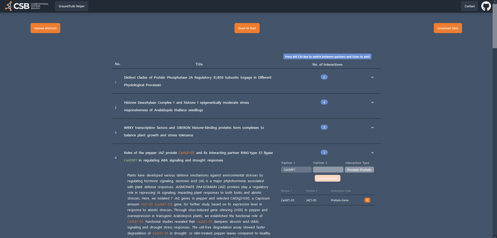
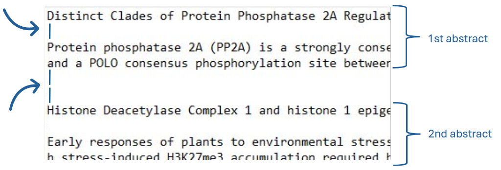
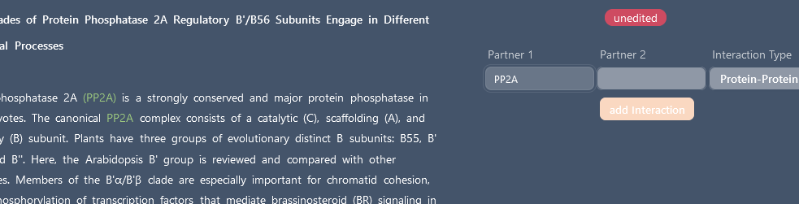
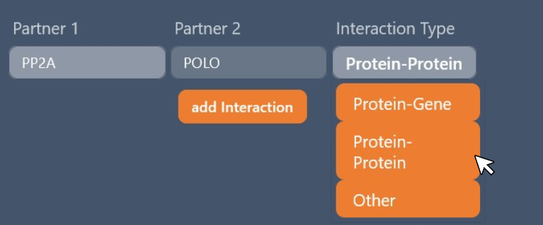
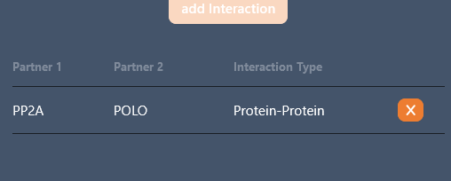
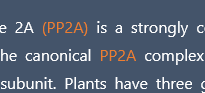
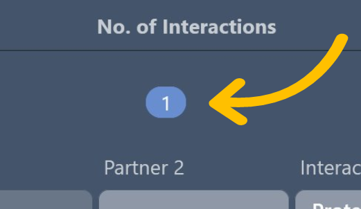
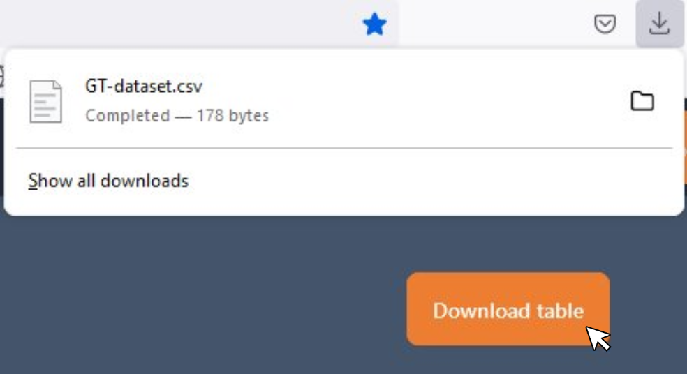

# About

This [Website](rookabu.github.io/Project-GTHelper/) is all about creating your own ground truth from abstracts. You can add as many interactions as you want for each abstract. For example Protein-Protein, Protein-Gene or your own type of interaction. 



## How to start?

First of all, start by uploading your abstracts with titles as a txt., csv., or tsv. file using the 'Upload abstracts' button. 

It's important that the titles are separated from its abstract by one line and an abstract should be followed by two lines before a new title starts.



After a quick load your abstracts should be shown in a table. 

## Start adding Interactions!

The first abstract should be already unfolded automatically, you can fold and unfold each abstract by clicking the row. Just click on a word in your abstract or title and it gets assigned to partner 1. Already clicked words are marked green but can be clicked again.



Now, click on a other word to add more to the first partner or just click in the field of partner 2 to add the next words to it. You can also use left control key to switch between partners.

After you added words to both partners, choose your type of interaction by clicking on it. This can be Protein-Protein, Protein-Gene or your own.



Add your newly build interaction by using the 'add Interaction' button or just press enter.



Now you sucessfully added your first interaction, which you can delete again if you want. Already added partners are marked orange.



The blue number indicates how many partners you already added for each abstract.



Now you can start finding interaction partners in each abstract until your done. You can close the website if you want, your progress will be saved.

## You are finished ?

You can easily download your created ground truth using the 'Download table' button. Your ground truth will be downloaded as a csv file and can be used to train a large language model or for other purposes.



## Want to edit other abstracts?

Just upload your next file or use the 'Reset to Start' button to return to the start.


Have fun! 


# Feliz Template

This template gets you up and running with a simple web app using [Fable](http://fable.io/) and [Feliz](https://github.com/Zaid-Ajaj/Feliz).

## Requirements

* [dotnet SDK](https://www.microsoft.com/net/download/core) v7.0 or higher
* [node.js](https://nodejs.org) v18+ LTS


## Editor

To write and edit your code, you can use either VS Code + [Ionide](http://ionide.io/), Emacs with [fsharp-mode](https://github.com/fsharp/emacs-fsharp-mode), [Rider](https://www.jetbrains.com/rider/) or Visual Studio.


## Development

Before doing anything, start with installing npm dependencies using `npm install`.

Then to start development mode with hot module reloading, run:
```bash
npm start
```
This will start the development server after compiling the project, once it is finished, navigate to http://localhost:8080 to view the application .

To build the application and make ready for production:
```
npm run build
```
This command builds the application and puts the generated files into the `deploy` directory (can be overwritten in webpack.config.js).

### Tests

The template includes a test project that ready to go which you can either run in the browser in watch mode or run in the console using node.js and mocha. To run the tests in watch mode:
```
npm run test:live
```
This command starts a development server for the test application and makes it available at http://localhost:8085.

To run the tests using the command line and of course in your CI server, you have to use the mocha test runner which doesn't use the browser but instead runs the code using node.js:
```
npm test
```

### git notes 

#### update developer to main

1. Make sure your working tree is in a clean state

``git status``

2. Check out the branch you want to change, e.g. some-branch

``git checkout some-branch``

3. Reset that branch to some other branch/commit, e.g. target-branch

``git reset --hard target-branch``
